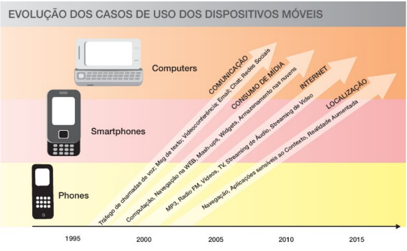
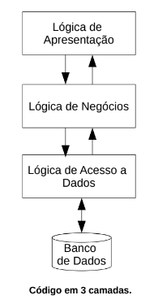
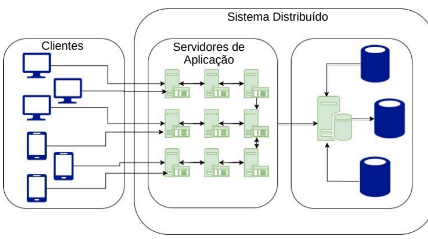

## Evolução dos Dispositivos Móveis

### Conceito

Pode ser definida como a capacidade de poder se deslocar ou ser deslocado
facilmente.

### Evolução dos Dispositivos Moveis



## 2. Arquitetura Mobile

### Introdução

As arquiteturas de aplicação são estruturas que permitem ilustrar ou destacar o layout total do projeto:

```
– Software: código da aplicação, por exemplo;
– Hardware: servidor, por exemplo;
```

### Arquitetura *Client-Server*

1. Caracterizada por um ou mais clientes solicitarem informações a um servidor.
2. A comunicação nesta arquitetura se dá em:

```
– Camadas;
– Filas;
```

### Comunicação em Camadas



Camadas numa visão *top-down*:

```
– Apresentação: exibição da interface gráfica;
– Negócios: lógica comercial;
– Acesso a dados: comunicação com o Banco de dados;
```

### Comunicação em Filas



1. Soluciona-se o problema existente na comunicação em camadas: escalabilidade.
2. Possui 3 filas:

```
– Apresentação;
– Aplicação (Negócios e Acesso a Dados);
– Base de Dados;
```

### Tipos de Clientes

1. Clientes Magros:

```
– Não possuem camada com código personalizado da aplicação;
– Todo o código fica no servidor;
– Compatíveis em qualquer sistema operacional;
– Frequentemente, acessíveis por meio de navegadores WEB;
```

2. Clientes Gordos:

```
– Possuem uma a três camadas de código localmente;
– Recomendados quando não há necessidade de comunicação permanente com o servidor;
– Armazenam dados no próprio dispositivo móvel até que possam ser sincronizados com o servidor;
```

3. Hospedagem de página WEB

```
– Disponibilizam um servidor web no dispositivo;
– Possuem as 3 camadas de código;
```

### Voce Sabia?

Os *Clientes Magros* são conhecidos como aplicativos **WEB Apps.**

Ahh...e os clientes gordos são conhecidos também como **Aplicativos Nativos.**

### Tipos de Servidores

1. Arquitetura One-tier (1 fila): As três camadas de código ficam em um mesmo servidor;

	```
	● Vantagens:
	– Implantação e desenvolvimento rápido;

	● Desvantagens:
	– Dificuldade de controle de segurança da aplicação;
	– Baixa escalabilidade;
	```

2. Arquitetura Two-tier (2 filas): O servidor do banco de dados fica separado da aplicação;

	```
	● Vantagens:
	– Possibilidade de escolher um local específico para armazenar o banco de dados;
	
	● Desvantagens:
	– Alto custo;
	– Baixa escalabilidade;
	– Dificuldade de controle de segurança da aplicação;
	```

3. Arquitetura Three-tier (3 filas): Os servidores de aplicação, negócios e banco de dados ficam em locais separados;

	```
	● Vantagens:
	– Alta escalabilidade;
	– Segurança provida por Firewalls;
	
	● Desvantagens:
	– Alto custo;
	– Gerenciamento complexo;
	```
