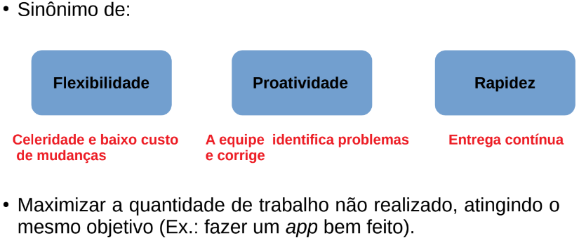
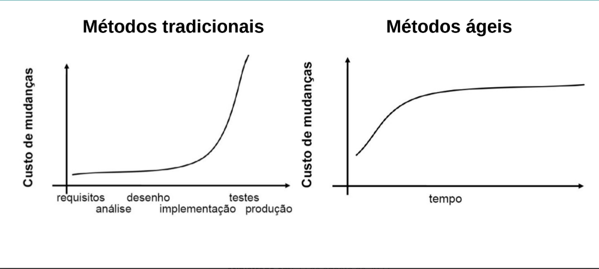
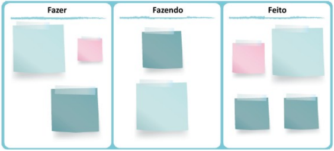

# Conceito de Agilidade



## Métodos tradicionais versus Ágeis

1. Métodos tradicionais: Baseados em especificação detalhada dos requisitos, projeto e testes.
2. Métodos ágeis: Têm o objetivo de criar software útil rapidamente, não se preocupando com a documentação completa em todas as fases.



# Manifesto ágil

```
● Movimento ocorrido em 2001, com a assinatura de 17 profissionais (programadores, consultores e desenvolvedores).

● Com o propósito de encontrar alternativas às metodologias de desenvolvimento tradicionais.

● Surgiram-se 4 valores e 12 princípios.
```

## Valores do manifesto ágil

1. Priorizar mais indivíduos e interações do que processos e ferramentas
2. Priorizar mais software em funcionamento do que documentação abrangente
3. Priorizar mais colaboração com o cliente do que negociação de contratos
4. Priorizar mais responder a mudanças do que seguir um plano.

## Princípios do manifesto ágil

1. **Satisfação do cliente:** A maior prioridade está em satisfazer o cliente por meio da entrega
adiantada e contínua de software de valor.

2. **Mudança em favor da vantagem competitiva:** Mudanças de requisitos são bem-vindas, mesmo em fases tardias do desenvolvimento.

3. **Prazos curtos:** Entregar software em funcionamento com frequência.

4. **Trabalho em conjunto:** Tanto pessoas relacionadas a negócios como desenvolvedores
devem trabalhar em conjunto.

5. **Ambientação e suporte:** Para construir projetos ao redor de indivíduos motivados, é preciso
dar a eles o ambiente e o suporte necessários, confiando que farão seu trabalho.

6. **Falar na cara:** O método mais eficiente de transmitir informações tanto externas como internas para um time de desenvolvimento é por meio de uma conversa face a face.

7. **Funcionalidade:** Um software funcional é a medida primária de progresso.

8. **Ambiente de sustentabilidade:** Processos ágeis promovem um ambiente sustentável, com
patrocinadores, desenvolvedores e usuários sendo capazes de manter passos constantes.

9. **Padrão altos de tecnologia e design:** A contínua atenção à excelência técnica e ao bom design aumenta a agilidade.

10. **Simplicidade:** Fazer algo simples é dominar a arte de maximizar a quantidade de trabalho que não precisou ser feito.

11. **Autonomia:** As melhores arquiteturas, os requisitos e os designs emergem de
times auto-organizáveis.

12. **Reflexões para otimizações:** Em intervalos regulares, o time reflete em como ficar mais efetivo,
então, se ajustam e otimizam seu comportamento de acordo.

## Características

```
● Não há especificação detalhada do sistema, e a documentação do projeto é minimizada ou gerada automaticamente;

● O sistema é desenvolvido em uma série de versões;

● Interfaces de usuário do sistema são geralmente desenvolvidas com um sistema interativo de desenvolvimento que permite a criação rápida do projeto.
```

## Principais Métodos ágeis

```
● SCRUM
● Kanban
● XP (Extreme Programming)
● TDD/ATDD (*Test Driven Development*, *Acceptance Test Driven Development*)
```

# Scrum

```
● Framework de processo ágil utilizado para gerenciar e controlar o
desenvolvimento de um produto de software.

● Basea-se em práticas iterativas e incrementais:
– Iterativo: produz releases (versões constantemente melhoradas)
– Incremental: produz builds (partes de software)

● Vantagem: o cliente pode receber/avaliar o produto mais cedo.
```

## Artefatos do scrum

```
● Product Backlog (Backlog do Produto): Lista de histórias que
compõem o produto.

● Sprint Backlog: Lista de histórias selecionadas para uma sprint.

● Product Increment (Incremento do Produto): Resultado do que foi
produzido ao final do trabalho realizado na sprint.
```

## Papéis do scrum

```
● Product Owner (Dono do Produto): É a pessoa responsável pelo
backlog do produto. Ele também define e prioriza as funcionalidades.

● Devlopment Team (Time de Desenvolvimento): Profissionais que
realizam o trabalho de entregar incrementalmente um produto “pronto”
ao final de cada sprint.

● Scrum Master: É o facilitador da equipe de desenvolvimento que
remove obstáculos que possam interferir no desenvolvimento do
produto.
```

## Outros termos do scrum

```
● Sprint Planning (Reunião de planejamento da sprint): planeja-se o
trabalho a ser realizado na sprint.

● Sprint: É a iteração do desenvolvimento (2~4 semanas).

● Daily Scrum (Reunião diária): Reunião diária, curta (15min) e em pé.

– O que você fez hoje?
– O que você fará amanhã?
– Que impedimentos surgiram e que atrapalharam sua produtividade?

● Burndown Chart (Gráfico burndown): Gráfico de acompanhamento.
```

# Kanban

```
● Método de desenvolvimento de software com fortes bases em
práticas enxutas e tem como objetivo otimizar o processo de
desenvolvimento de software preexistente.

● Principais práticas:

– Visualizar o fluxo de trabalho (workflow)
– Limitar o trabalho em progresso
– Gerenciar e medir o fluxo
```


