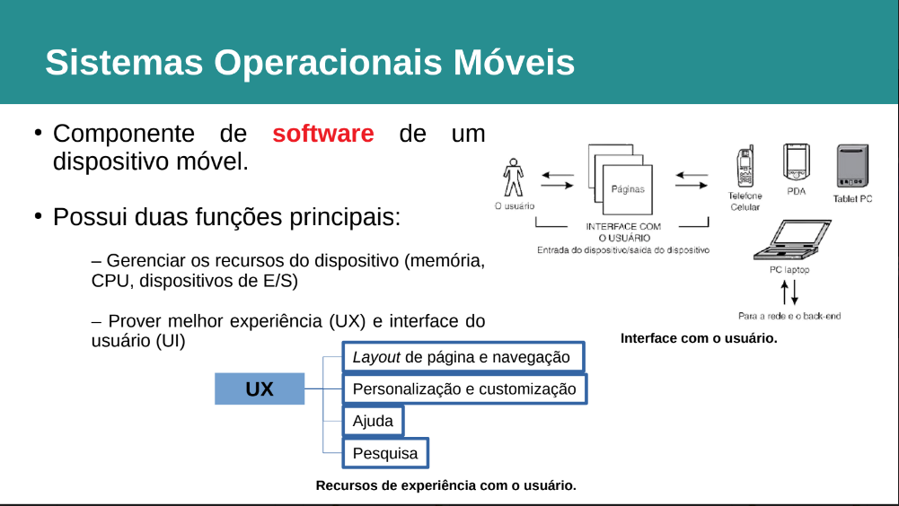

# Sistemas Operacionais



## Android versus iOS

### Android

```
● Desenvolvido pela Google
● Código open-source
● Baseado em Linux
● Plataformas: TV Android, Android Auto e Android Wear
● App Store: Google Play
● Principal linguagem de programação: Java
● Atualmente (2022), encontra-se na versão 12 ("Snow Cone")
```

### iOS (iPhone OS)

```
● Desenvolvido pela Apple
● Código proprietário (e licenciado)
● Baseado em Unix
● Plataformas: iPhone, iPad, Apple TV, MacBook e Apple Watch
● App Store: AppStore
● Principal linguagem de programação: Objective-C/Swift
● Atualmente (2022), encontra-se na versão 16
```
